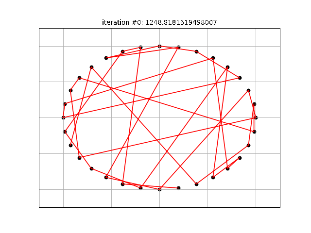

# Genetic_Algorithm
Overview of genetic algorithm and application to the traveling salesman problem.

***
### Table of Contents
 * Introduction
 * Selection
   * Deterministi Selection
   * Probabilistic Selection
     * Roulette Wheel Selection
     * Stochastic Universal Sampling
     * Ranking Selection
     * Tournament Selection
     * Selection Pressure
 * Genetic Operators
   * Mutation
   * Crossover
 * Replacement Strategies
